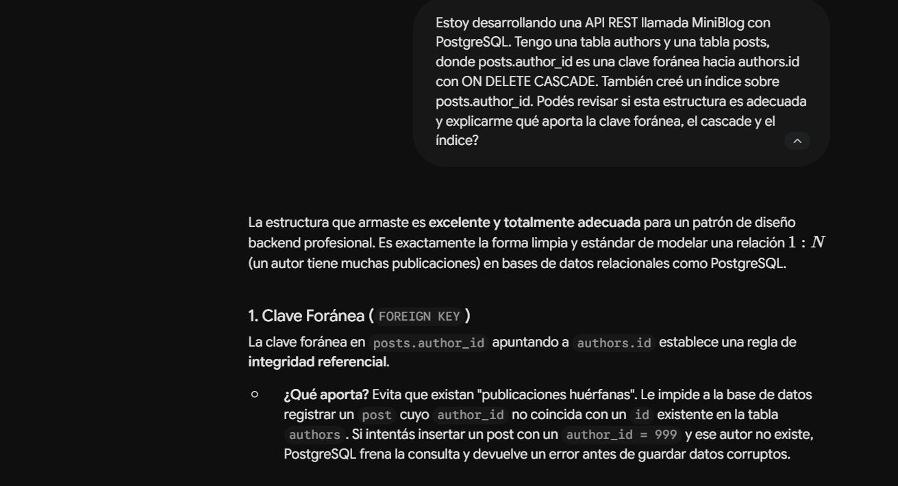
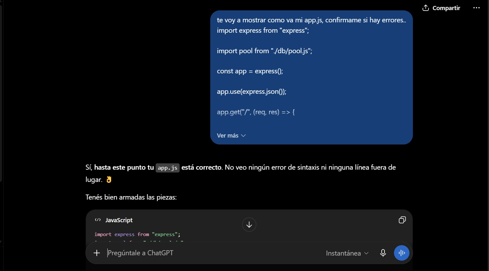
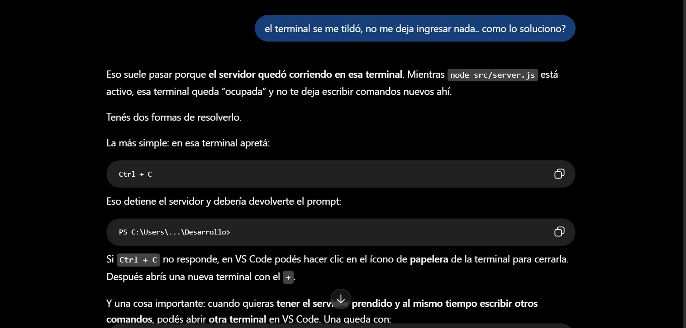
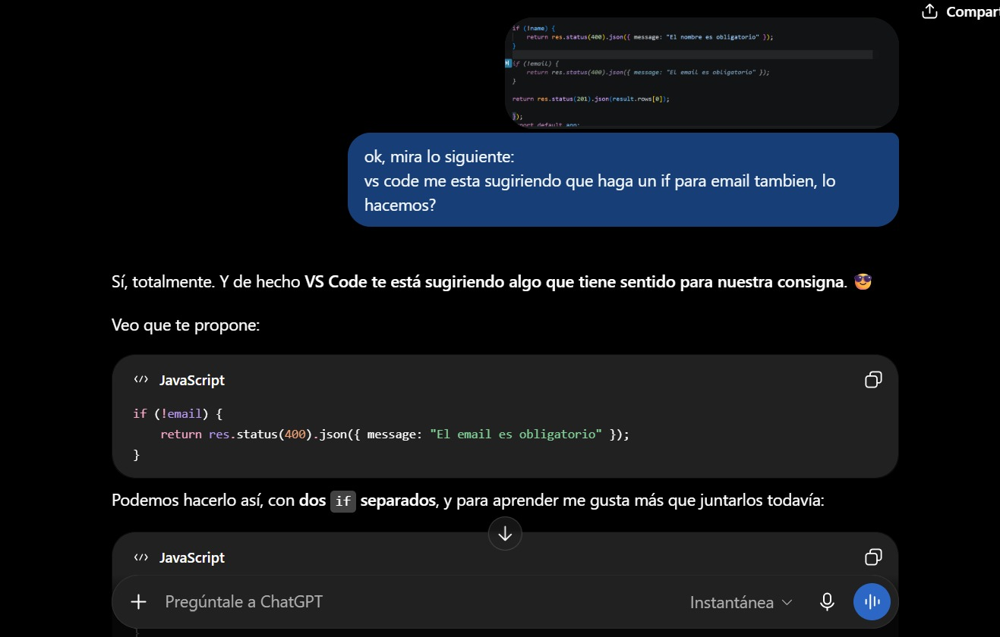
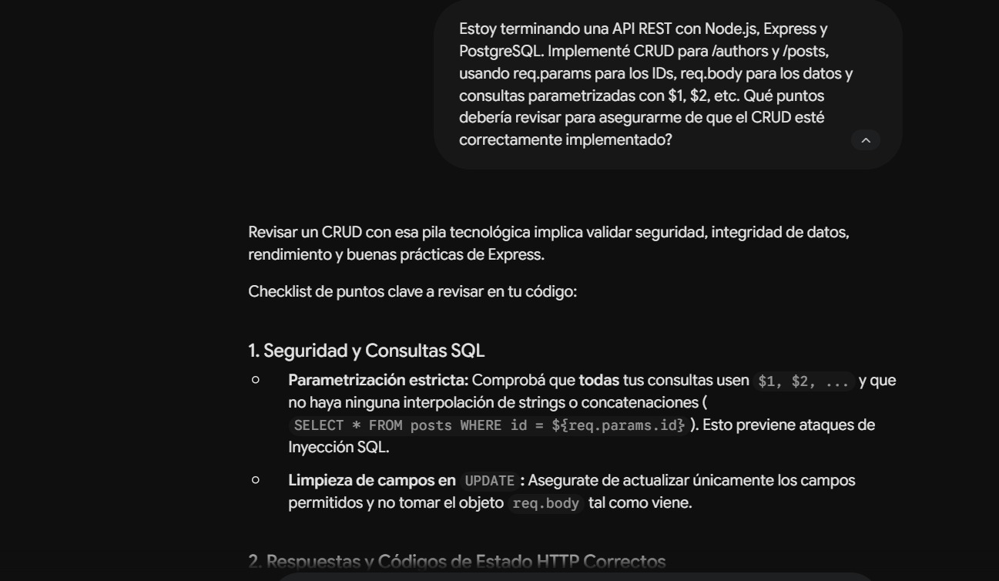
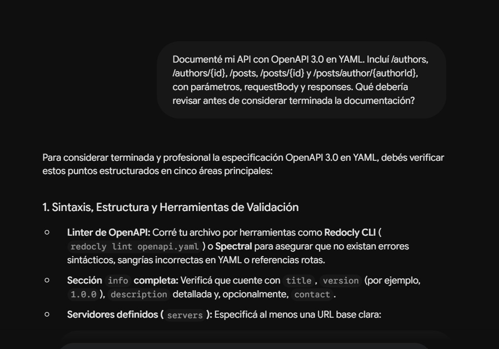

# Documentación del uso de IA

## Proyecto Integrador Módulo 2 — MiniBlog API

Durante el desarrollo del proyecto utilicé ChatGPT como herramienta de apoyo para comprender conceptos de backend, resolver errores y revisar partes de la implementación.

La IA se utilizó como acompañamiento durante el proceso. Las soluciones fueron probadas utilizando PostgreSQL, Node.js, Express, Thunder Client y tests automatizados.

---

## 1. Base de datos y PostgreSQL

Se utilizó IA para comprender la creación y relación de las tablas `authors` y `posts`, incluyendo conceptos como claves primarias, claves foráneas, restricciones, índices y `ON DELETE CASCADE`.

También se recibió orientación para configurar PostgreSQL, ejecutar los archivos `setup.sql` y `seed.sql` y comprobar la relación entre autores y publicaciones.

---

## 2. Node.js, Express y PostgreSQL

Se realizaron consultas para comprender la conexión entre Node.js y PostgreSQL mediante `pg`, el uso de variables de entorno y la configuración del pool de conexiones.

Durante el desarrollo de Express se utilizó IA para revisar el código, detectar errores y comprender conceptos como rutas, `req`, `res`, `req.params`, `req.body` y consultas SQL desde JavaScript.

También se consultó sobre el funcionamiento del servidor cuando la terminal permanecía ocupada mientras Node.js estaba ejecutándose.

---

## 3. CRUD y validaciones

Se utilizó IA como apoyo durante la implementación del CRUD de autores y publicaciones y para revisar el uso de códigos HTTP como `200`, `201`, `204`, `400`, `404` y `500`.

También se trabajó sobre la validación de campos obligatorios y errores de PostgreSQL relacionados con emails duplicados y claves foráneas.

---

## 4. Tests y documentación

Se recibió orientación para crear tests de la API utilizando Supertest y el módulo de testing de Node.js.

También se utilizó IA para preparar la documentación OpenAPI, comprender la sintaxis YAML y corregir errores detectados por Redocly CLI.

La documentación OpenAPI fue validada correctamente.

---

## 5. Documentación y despliegue

Se utilizó IA para organizar el README, documentar la instalación y ejecución del proyecto y preparar la aplicación para su despliegue.

La sección correspondiente al despliegue se completará una vez finalizada la publicación de la API en Railway.

---

## Conclusión

ChatGPT se utilizó principalmente como herramienta de aprendizaje, revisión y resolución de dudas durante el desarrollo. Las funcionalidades fueron implementadas y probadas durante el proceso antes de incorporarlas al proyecto final.